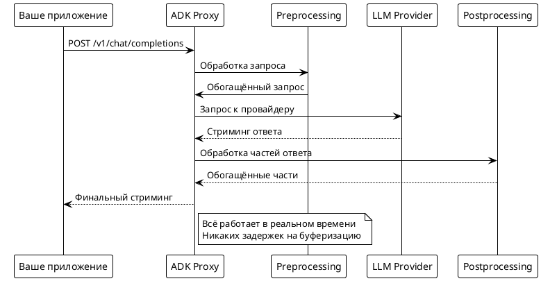

# Статья 1: Proxy LLM со стримингом — чайник в розетку

Что если LLM можно подключить к вашему сервису так же просто, как чайник в розетку? Буквально: воткнул, включил, работает. Но при этом у вас есть полный контроль над тем, что происходит с запросами и ответами.

Сегодня расскажу, как я создал **adk-llm-proxy** — умный прокси-сервер для языковых моделей, который работает в режиме стриминга и может делать кое-что интересное с данными на лету.

## Зачем вообще нужен прокси для LLM?

Представьте: у вас есть приложение, которое общается с OpenAI. Всё работает, но внезапно вы понимаете:

- Хочется логировать все запросы и ответы
- Нужно подменить провайдера (с OpenAI на Ollama или DeepSeek) без переписывания кода
- Хочется добавить кеширование или rate limiting
- Нужно обогащать ответы дополнительной информацией

Обычно это означает переписывание половины приложения. А с прокси всё становится проще — вы просто меняете endpoint с `https://api.openai.com/v1` на `http://localhost:8001/v1`, и магия начинается.

## Быстрый старт: запускаем за 30 секунд

```bash
git clone https://github.com/mshogin/adk-llm-proxy.git
cd adk-llm-proxy
pip install -r requirements.txt

# Ставим ваш OpenAI ключ
export OPENAI_API_KEY="your-key-here"

# Запускаем
python main.py -provider openai -model gpt-4o-mini
```

Всё! Теперь у вас на `http://localhost:8001` крутится прокси, который умеет всё то же самое, что и OpenAI API, но с дополнительными возможностями.

## Проверяем, что работает

```bash
curl -X POST http://localhost:8001/v1/chat/completions \
  -H "Content-Type: application/json" \
  -d '{
    "model": "gpt-4o-mini",
    "messages": [{"role": "user", "content": "Привет!"}],
    "stream": true
  }'
```

И вы увидите, как ответ приходит частями в реальном времени — именно так, как это делает ChatGPT в браузере.

## Архитектура: что под капотом



Ключевая фишка — всё работает в режиме стриминга. Данные не буферизуются, а обрабатываются "на лету" и сразу отправляются дальше. Это означает, что пользователь видит ответ практически мгновенно, как в ChatGPT.

## Мультипровайдерность из коробки

Хотите переключиться на локальную Ollama? Легко:

```bash
python main.py -provider ollama -model mistral
```

Или попробовать DeepSeek (в разы дешевле OpenAI):

```bash
export DEEPSEEK_API_KEY="your-deepseek-key"
python main.py -provider deepseek -model deepseek-chat
```

Ваше приложение даже не заметит разницы — API остаётся тем же самым.

## Почему стриминг так важен?

Когда я тестировал разные подходы, стало очевидно: пользователи не хотят ждать. Они хотят видеть, как модель "думает" в реальном времени. Это создаёт ощущение живого диалога, а не взаимодействия с тормозным роботом.

При этом технически стриминг намного сложнее — нужно правильно обрабатывать частичные ответы, управлять соединениями, не терять данные. Но результат того стоит.

## Google ADK: секретный ингредиент

Под капотом прокси использует Google Agent Development Kit — это такая штука для создания "умных агентов". Пока что она работает довольно прозрачно, но уже в следующих версиях мы начнём использовать её для интересных экспериментов.

Представьте, что ваша модель может не просто отвечать на вопросы, а анализировать контекст, принимать решения о том, как лучше обработать запрос, и даже "размышлять" перед тем, как дать окончательный ответ.

## Что дальше?

Сейчас прокси умеет принимать запросы и красиво их передавать дальше. Но что если научить его делать что-то интересное с данными ещё до того, как они попадут к модели?

В следующей части покажу, как добавить preprocessing и postprocessing — и как это открывает совершенно новые возможности для работы с LLM. Спойлер: можно делать такие вещи, которые сама модель сделать не может.

---

**Попробуйте сами**: клонируйте репозиторий и запустите прокси с вашим любимым провайдером. В комментариях пишите, какие идеи для обработки данных "на лету" приходят вам в голову!