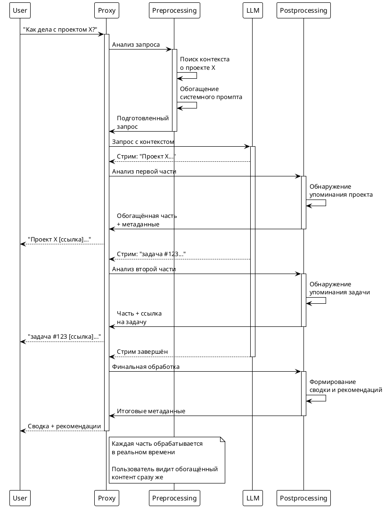

# Статья 2: Preprocessing и Postprocessing — учим LLM думать глубже

А что если научить LLM думать чуть глубже — ещё до того, как он заговорит? И что если обогащать его ответы уже после того, как он их сгенерировал? Сегодня покажу, как превратить обычный прокси в интеллектуальный конвейер обработки данных.

В прошлой статье мы запустили базовый прокси, который просто перенаправляет запросы. Но настоящая магия начинается, когда мы добавляем этапы pre- и postprocessing. Это как дать модели личного помощника, который готовит материалы перед встречей и оформляет протокол после.

## Зачем нужны эти этапы?

Представьте ситуацию: пользователь спрашивает "Как дела с проектом X?". Обычная модель ответит что-то общее. А умная система сначала:

1. **Preprocessing**: Поймёт, что нужно найти информацию о проекте X
2. **Обогатит контекст**: Добавит данные о последних коммитах, статусах задач, метриках
3. **Отправит модели**: Уже подготовленный запрос с полным контекстом
4. **Postprocessing**: Структурирует ответ, добавит ссылки, графики, рекомендации

Результат: вместо "Не знаю, у меня нет доступа к проекту X" пользователь получает детальный отчёт со статистикой и рекомендациями.

## Что происходит внутри preprocessing

Посмотрим на реальный код из проекта:

```python
async def inject_context(request_data: Dict[str, Any]) -> Dict[str, Any]:
    """Добавляем контекст в запрос перед отправкой модели"""

    messages = request_data.get("messages", [])

    # Анализируем последнее сообщение пользователя
    user_message = messages[-1]["content"] if messages else ""

    # Ищем упоминания проектов, задач, файлов
    context_hints = extract_context_hints(user_message)

    if context_hints:
        # Обогащаем системный промпт дополнительной информацией
        enhanced_prompt = f"""
        Дополнительный контекст:
        - Проекты: {context_hints.get('projects', [])}
        - Файлы: {context_hints.get('files', [])}
        - Временной период: {context_hints.get('timeframe', 'последняя неделя')}

        Используй эту информацию для более точного ответа.
        """

        # Добавляем в начало диалога
        messages.insert(0, {
            "role": "system",
            "content": enhanced_prompt
        })

    return request_data
```

## Магия postprocessing

А вот что происходит с ответом модели:

```python
async def analyze_response_content(response_chunk: str) -> Dict[str, Any]:
    """Анализируем и обогащаем каждую часть ответа"""

    analysis = {
        "enhancements": [],
        "metadata": {},
        "links": []
    }

    # Ищем упоминания кода, файлов, URL
    if re.search(r'`[^`]+`', response_chunk):
        analysis["enhancements"].append("code_detected")
        analysis["metadata"]["has_code"] = True

    # Ищем упоминания задач или проектов
    task_matches = re.findall(r'(задач[аи]|task|issue)\s+#?(\w+)', response_chunk, re.I)
    if task_matches:
        analysis["enhancements"].append("tasks_mentioned")
        analysis["links"] = [f"https://youtrack.company.com/issue/{match[1]}"
                           for match in task_matches]

    return analysis
```

## Диаграмма обработки: как это работает в стриминге



## Практический пример: фильтр безопасности

Допустим, вы хотите фильтровать потенциально опасные запросы:

```python
async def security_filter(request_data: Dict[str, Any]) -> Dict[str, Any]:
    """Проверяем запрос на безопасность"""

    messages = request_data.get("messages", [])
    user_content = " ".join([msg.get("content", "") for msg in messages])

    # Список потенциально опасных ключевых слов
    danger_keywords = ["password", "secret", "hack", "exploit"]

    if any(keyword in user_content.lower() for keyword in danger_keywords):
        # Заменяем опасный запрос безопасным
        request_data["messages"] = [{
            "role": "user",
            "content": "Расскажи о лучших практиках безопасности в разработке"
        }]

        # Добавляем метку для postprocessing
        request_data["_security_filtered"] = True

    return request_data
```

И соответствующий postprocessing:

```python
async def add_security_warning(response_chunk: str, metadata: Dict) -> str:
    """Добавляем предупреждение о безопасности"""

    if metadata.get("_security_filtered"):
        if "Лучшие практики" in response_chunk:
            return response_chunk + "\n\n⚠️ Внимание: ваш исходный запрос был изменён по соображениям безопасности."

    return response_chunk
```

## Конфигурация: включаем и выключаем этапы

Всё это легко настраивается через конфигурацию:

```python
# В config.py
ENABLE_CONTEXT_INJECTION: bool = True
ENABLE_RESPONSE_ANALYTICS: bool = True
ENABLE_SECURITY_FILTER: bool = True

# Можно настроить поведение для разных моделей
MODEL_SPECIFIC_CONFIG = {
    "gpt-4o-mini": {
        "context_injection": True,
        "max_context_length": 4000
    },
    "mistral": {
        "context_injection": False,  # Локальная модель, контекст не нужен
        "security_filter": False
    }
}
```

## Результат: из простого прокси в умного помощника

Что получилось в итоге:

1. **Пользователь** пишет простой вопрос
2. **Preprocessing** обогащает запрос контекстом и проверяет безопасность
3. **LLM** получает максимально подготовленную информацию
4. **Postprocessing** структурирует ответ, добавляет ссылки и метаданные
5. **Пользователь** получает не просто текст, а готовое решение с ссылками и рекомендациями

И всё это работает в реальном времени, без задержек на буферизацию.

## Что дальше?

Сейчас мы научились обогащать запросы и ответы. Но что если пойти дальше и добавить настоящее reasoning — способность модели "размышлять" пошагово над сложными задачами? Представьте, что модель не просто отвечает, а показывает весь процесс своих рассуждений в реальном времени.

В следующей части покажу, как это реализовать и как это кардинально меняет качество ответов для сложных задач. Спойлер: это выглядит почти как наблюдение за мыслительным процессом человека.

---

**Попробуйте сами**: добавьте свой preprocessing этап — например, автоматическое добавление текущей даты в системный промпт. Или создайте postprocessing, который автоматически генерирует краткую сводку для длинных ответов!