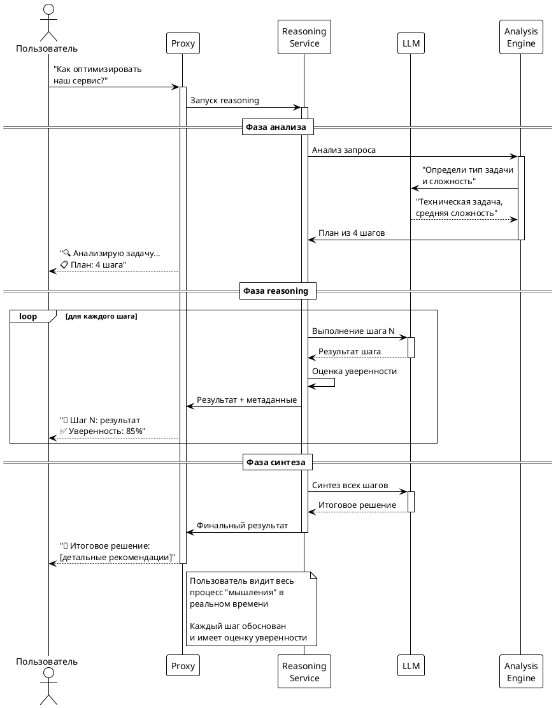

# Статья 3: Reasoning в реальном времени — наблюдаем, как думает ИИ

Представьте, что модель рассуждает в реальном времени у вас на глазах… Сначала анализирует задачу, потом разбивает её на шаги, затем последовательно решает каждый пункт, и вы видите весь этот процесс "мышления" в прямом эфире. Сегодня покажу, как добавить reasoning в наш прокси и почему это меняет всё.

В предыдущих частях мы научились обогащать запросы перед отправкой к модели и улучшать ответы после получения. Но reasoning — это совсем другой уровень. Это когда модель не просто отвечает на вопрос, а показывает, КАК она к этому ответу пришла.

## Что такое reasoning и зачем оно нужно?

Обычная модель на вопрос "Как оптимизировать производительность нашего сервиса?" выдаст общий список рекомендаций. А модель с reasoning сначала:

1. **Анализирует контекст**: "Вижу, что речь о веб-сервисе на Python с базой данных..."
2. **Планирует подход**: "Нужно проверить несколько аспектов: database queries, caching, resource utilization..."
3. **Исследует по шагам**: "Сначала посмотрю на базу данных..." → "Теперь проанализирую кеширование..." → "Проверю использование ресурсов..."
4. **Синтезирует результат**: "На основе анализа вижу 3 критические проблемы..."

И вы видите весь этот процесс в реальном времени, как будто наблюдаете за тем, как думает эксперт.

## Как это работает изнутри

Вот упрощённая версия reasoning engine из проекта:

```python
class ReasoningService:
    async def enhance_with_reasoning(self, messages: List[Dict]) -> Dict[str, Any]:
        """Добавляем reasoning к обычному запросу"""

        user_query = messages[-1]["content"]

        # Фаза 1: Анализ задачи
        analysis_prompt = f"""
        Проанализируй запрос: "{user_query}"

        Определи:
        1. Тип задачи (техническая, аналитическая, творческая)
        2. Сложность (простая, средняя, сложная)
        3. Необходимые шаги для решения
        4. Потенциальные источники информации

        Ответь структурированно.
        """

        # Получаем план рассуждений
        reasoning_plan = await self._get_reasoning_plan(analysis_prompt)

        # Фаза 2: Пошаговое выполнение
        reasoning_steps = []
        for step in reasoning_plan["steps"]:
            step_result = await self._execute_reasoning_step(step, user_query)
            reasoning_steps.append(step_result)

        # Фаза 3: Синтез результата
        final_result = await self._synthesize_reasoning(reasoning_steps, user_query)

        return {
            "enhanced_messages": self._prepare_enhanced_messages(messages, reasoning_steps),
            "reasoning_metadata": {
                "plan": reasoning_plan,
                "steps": reasoning_steps,
                "synthesis": final_result
            }
        }

    async def _execute_reasoning_step(self, step: Dict, context: str) -> Dict:
        """Выполняем один шаг reasoning"""

        step_prompt = f"""
        Контекст: {context}
        Текущий шаг: {step["description"]}
        Цель: {step["goal"]}

        Выполни этот шаг рассуждения максимально детально.
        """

        result = await self.llm_client.complete(step_prompt)

        return {
            "step_id": step["id"],
            "description": step["description"],
            "result": result,
            "confidence": self._calculate_confidence(result),
            "next_steps": self._suggest_next_steps(result)
        }
```

## Стриминг reasoning: показываем процесс мышления

Самое интересное — как это выглядит для пользователя в режиме стриминга:

```python
async def stream_reasoning_response(self, request_data: Dict) -> AsyncGenerator[str, None]:
    """Стримим процесс reasoning в реальном времени"""

    messages = request_data["messages"]

    # Начинаем с сообщения о начале reasoning
    yield self._format_reasoning_start()

    # Фаза 1: Показываем анализ задачи
    yield "🔍 **Анализирую задачу...**\n\n"

    reasoning_result = await self.reasoning_service.enhance_with_reasoning(messages)

    # Показываем план
    yield f"📋 **План рассуждений:**\n"
    for i, step in enumerate(reasoning_result["reasoning_metadata"]["plan"]["steps"], 1):
        yield f"{i}. {step['description']}\n"

    yield "\n---\n\n"

    # Фаза 2: Стримим выполнение каждого шага
    for step in reasoning_result["reasoning_metadata"]["steps"]:
        yield f"🤔 **Шаг {step['step_id']}: {step['description']}**\n\n"

        # Стримим результат шага частями
        step_content = step["result"]
        for chunk in self._chunk_content(step_content):
            yield chunk
            await asyncio.sleep(0.1)  # Имитируем реальное время размышления

        confidence_emoji = "✅" if step["confidence"] > 0.8 else "⚠️"
        yield f"\n\n{confidence_emoji} *Уверенность: {step['confidence']:.1%}*\n\n---\n\n"

    # Фаза 3: Финальный синтез
    yield "🎯 **Итоговое решение:**\n\n"

    synthesis = reasoning_result["reasoning_metadata"]["synthesis"]
    for chunk in self._chunk_content(synthesis):
        yield chunk
        await asyncio.sleep(0.05)

    yield "\n\n💡 *Процесс reasoning завершён*"
```

## Диаграмма потока reasoning



## Пример реального reasoning в действии

Запрос: "Как оптимизировать производительность нашего Python API?"

**Вывод в реальном времени:**

```
🔍 Анализирую задачу...

📋 План рассуждений:
1. Анализ архитектуры и bottlenecks
2. Исследование database performance
3. Оценка caching стратегий
4. Проверка resource utilization

---

🤔 Шаг 1: Анализ архитектуры и bottlenecks

Первым делом нужно понять, где именно возникают узкие места в вашем API.
Обычно проблемы кроются в нескольких местах:

- Медленные database queries (часто 70-80% проблем)
- Отсутствие кеширования повторяющихся операций
- Неэффективная сериализация данных
- Блокирующие I/O операции

Рекомендую начать с профилирования с помощью tools типа cProfile или py-spy...

✅ Уверенность: 92%

---

🤔 Шаг 2: Исследование database performance

Анализирую типичные проблемы с базой данных в Python API...

[продолжается детальный анализ каждого аспекта]

⚠️ Уверенность: 75%

---

🎯 Итоговое решение:

На основе проведённого анализа вижу 3 критические области для оптимизации:

1. **Database Layer** (приоритет 1): Добавить индексы на часто используемые поля,
   внедрить connection pooling, оптимизировать N+1 queries

2. **Caching Strategy** (приоритет 2): Внедрить Redis для кеширования результатов
   expensive operations, добавить application-level cache для frequently accessed data

3. **Async Processing** (приоритет 3): Переписать blocking operations на async/await,
   использовать background tasks для тяжёлых операций

Ожидаемый результат: улучшение response time на 60-80%.

💡 Процесс reasoning завершён
```

## Адаптивное reasoning: умнее с каждым запросом

Система учится на каждом запросе:

```python
class AdaptiveReasoning:
    def __init__(self):
        self.reasoning_history = []
        self.success_patterns = {}

    async def adapt_reasoning_strategy(self, request_type: str, previous_results: List[Dict]):
        """Адаптируем стратегию reasoning на основе истории"""

        # Анализируем успешные паттерны
        successful_approaches = [
            r for r in previous_results
            if r.get("user_satisfaction", 0) > 0.8
        ]

        if successful_approaches:
            # Выделяем успешные паттерны
            best_pattern = max(successful_approaches, key=lambda x: x["user_satisfaction"])

            # Адаптируем текущую стратегию
            return {
                "steps": best_pattern["reasoning_steps"],
                "confidence_threshold": best_pattern["confidence_threshold"],
                "detail_level": best_pattern["detail_level"]
            }

        return self.default_strategy
```

## Результат: от простых ответов к экспертным решениям

Что изменилось с добавлением reasoning:

**Было**: "Для оптимизации API используйте кеширование, оптимизируйте запросы к БД, добавьте асинхронность."

**Стало**: Детальный анализ с планом, пошаговое исследование каждого аспекта, обоснованные рекомендации с приоритетами и ожидаемыми результатами, всё в реальном времени.

## Куда двигаться дальше?

Reasoning — это только начало. Представьте, что будет, когда мы добавим:

- **MCP интеграцию**: прокси сможет автоматически подключаться к внешним системам (GitLab, YouTrack, базам знаний) для получения актуальной информации
- **Multi-agent orchestration**: несколько специализированных агентов будут работать вместе над сложными задачами
- **Adaptive learning**: система будет учиться на каждом взаимодействии и становиться умнее

Уже сейчас в roadmap проекта заложена поддержка MCP (Model Context Protocol) — стандарта для интеграции с внешними системами. Это позволит создавать по-настоящему умных помощников, которые не просто генерируют текст, а решают реальные бизнес-задачи.

## Заключение: от прокси к умному партнёру

За три статьи мы прошли путь от простого прокси-сервера до интеллектуальной системы с reasoning. Но самое интересное впереди — когда все эти технологии объединятся в единую экосистему умных агентов.

Если вас заинтересовал проект, попробуйте его сами. А если хотите участвовать в развитии — welcome в contributors! Впереди много интересных задач: от MCP интеграции до создания специализированных агентов для разных доменов.

---

**Попробуйте сами**: запустите прокси с включённым reasoning и задайте ему сложную техническую задачу. Посмотрите, как он будет размышлять над решением в реальном времени. В комментариях делитесь, какие задачи он решил лучше всего!